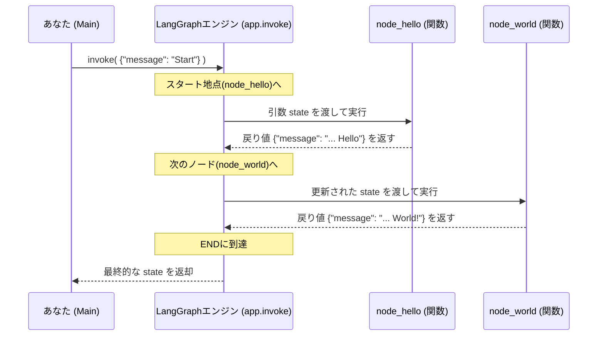
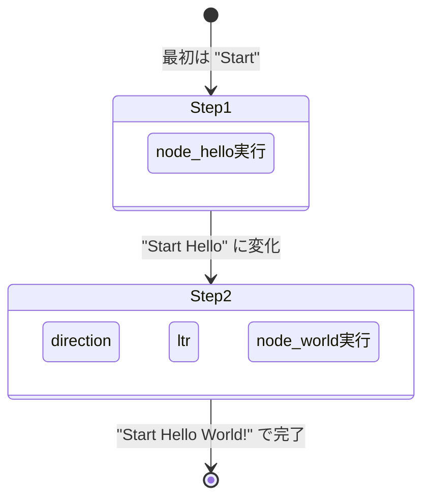
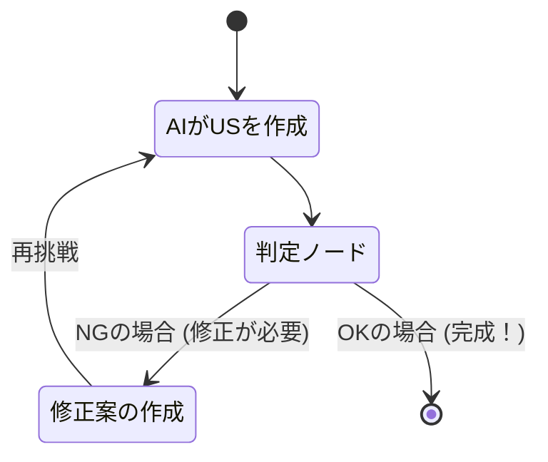

# シーケンス図

```mermaid
sequenceDiagram
    participant User as あなた (Main)
    participant App as LangGraphエンジン (app.invoke)
    participant N1 as node_hello (関数)
    participant N2 as node_world (関数)

    User->>App: invoke( {"message": "Start"} )
    
    Note over App: スタート地点(node_hello)へ
    App->>N1: 引数 state を渡して実行
    N1-->>App: 戻り値 {"message": "... Hello"} を返す
    
    Note over App: 次のノード(node_world)へ
    App->>N2: 更新された state を渡して実行
    N2-->>App: 戻り値 {"message": "... World!"} を返す
    
    Note over App: ENDに到達
    App-->>User: 最終的な state を返却
```
# 状態遷移図

```mermaid
stateDiagram-v2
    [*] --> Step1: 最初は "Start"
    Step1 --> Step2: "Start Hello" に変化
    Step2 --> [*]: "Start Hello World!" で完了

    state Step1 {
        direction ltr
        node_hello実行
    }
    state Step2 {
        direction ltr
        node_world実行
    }
```
# 条件分岐あり

```mermaid
stateDiagram-v2
    [*] --> AIがUSを作成
    AIがUSを作成 --> 判定ノード
    
    判定ノード --> 修正案の作成: NGの場合 (修正が必要)
    修正案の作成 --> AIがUSを作成: 再挑戦
    
    判定ノード --> [*]: OKの場合 (完成！)

    state 判定ノード <<choice>>
```